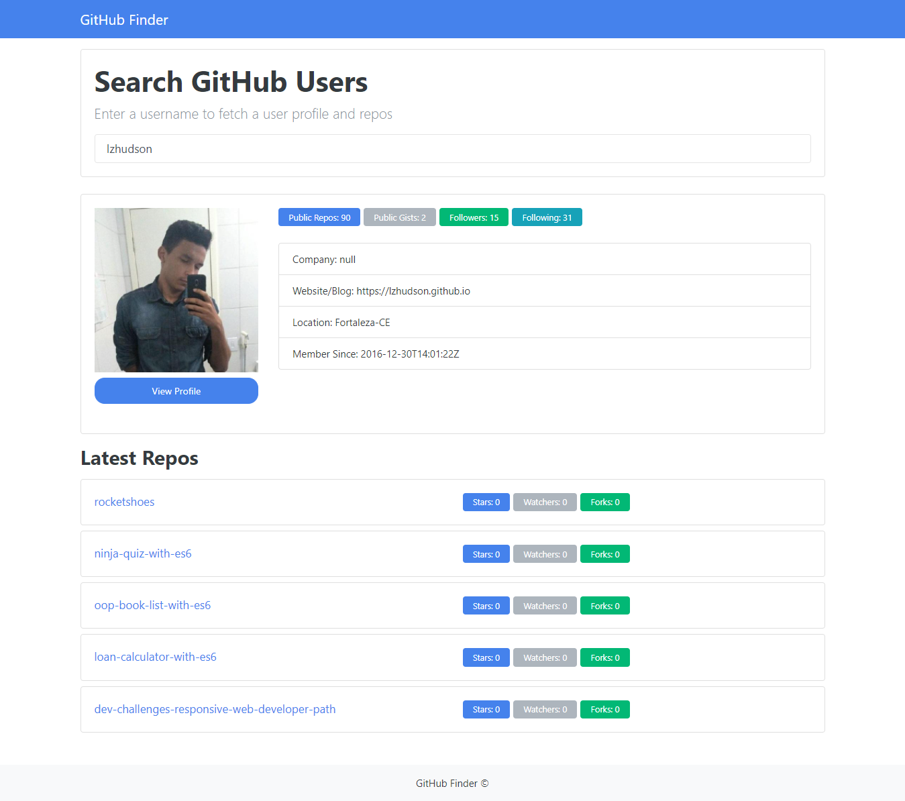

<h1 align="center"> Github Finder </h1>
<p align="center">
  <a href="https://opensource.org/licenses/MIT">
    
  </a>
</p>

<p align="center">
   
</p>


<p align="center">Simple app to search and display user github informations.(ES6)</p>

# :pushpin: Table of Contents

* [Features](#rocket-features)
* [Installation](#construction_worker-installation)
* [FAQ](#postbox-faq)

# :rocket: Features
* Fetch Profile Data.
* Diplay Profile.
* Show Alert Message.
* Fetching Repos.
* Display Repos.

# :construction_worker: Installation

**You need to install [Node.js](https://nodejs.org/en/download/) and [Yarn](https://yarnpkg.com/) first, then in order to clone the project via HTTPS, run this command:**

```
git clone https://github.com/lzhudson/github-finder-with-es6.git
```

**Install dependencies**

```
yarn
```

**Start development server**

```
yarn dev
```

# :postbox: Faq

**Question** What JavaScript features were used?

- [Class](https://developer.mozilla.org/pt-BR/docs/Web/JavaScript/Reference/Classes)
- [Async/Await](https://developer.mozilla.org/pt-BR/docs/Web/JavaScript/Reference/Statements/funcoes_assincronas)
- [Promise](https://developer.mozilla.org/pt-BR/docs/Web/JavaScript/Reference/Global_Objects/Promise)

**Question** What other were used to build the application?

**Answer:**

- [JavaScript ES6](https://developer.mozilla.org/pt-BR/docs/Web/JavaScript)
- [Webpack](https://webpack.js.org/)
- [Babel](https://babeljs.io/)

Made with love by [Hudson Holanda](https://github.com/lzhudson) 💜🚀